# /clean-install — recreate the project from scratch in Xcode

This skill is the documented fallback for the case where the bundled `.xcodeproj` won't build cleanly on the user's machine and they'd rather start fresh than debug Apple-side build infrastructure. It produces a functionally identical project to the bundled one.

The skill is a mix of manual Xcode UI steps (creating the project, adding the extension target, configuring signing) and automated file edits (Info.plist, Swift sources, build verification, install). Stop after each manual step and wait for the user to confirm before continuing.

## Preflight

Ask the user to confirm three parameters; offer the defaults below.

| Parameter | Default | Notes |
|---|---|---|
| Host app / project name | `EasyPlaintextQuicklookExtension` | becomes the Swift module name; CamelCase, no separators |
| Extension target name | `PreviewExtension` | bundle ID becomes `<host-app-bundle-id>.PreviewExtension` |
| Organization Identifier | the user's reverse-DNS, e.g. `com.justinppearson` | bundle ID for the host app becomes `<org-id>.<project-name>` |

If the user picks different values, substitute them everywhere below.

Throughout the skill, refer to the user's chosen values as `$PROJECT`, `$EXT`, and `$ORG`.

## Phase 1 — Create the host-app project (manual, in Xcode)

Tell the user:

1. Open Xcode. From the Welcome window click **Create New Project…** or use **File → New → Project** (⇧⌘N).

   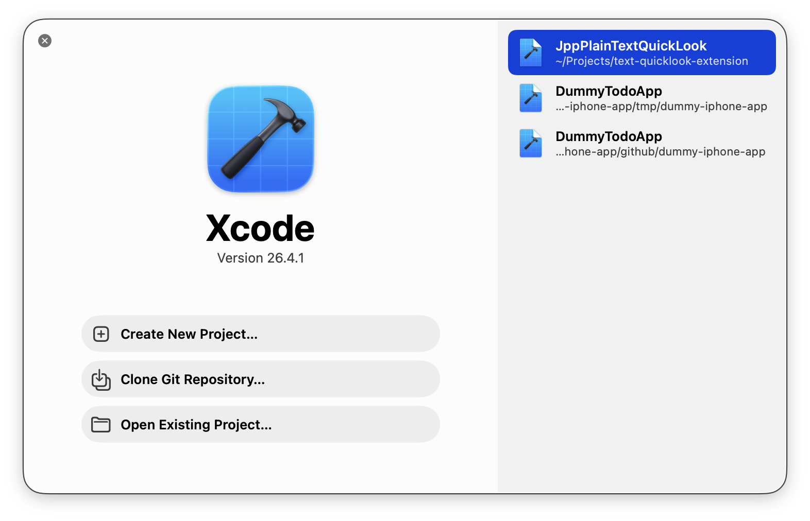

2. **Template chooser**: along the top, click the **macOS** tab. In the **Application** group, select **App**. Click **Next**.
3. **Options form**: Product Name = `$PROJECT`, Team = your Apple Developer team, Organization Identifier = `$ORG`, Interface = SwiftUI, Language = Swift, Storage = None, Host in CloudKit = unchecked, **Include Tests = unchecked** (we don't need tests for this project). Click **Next**.

   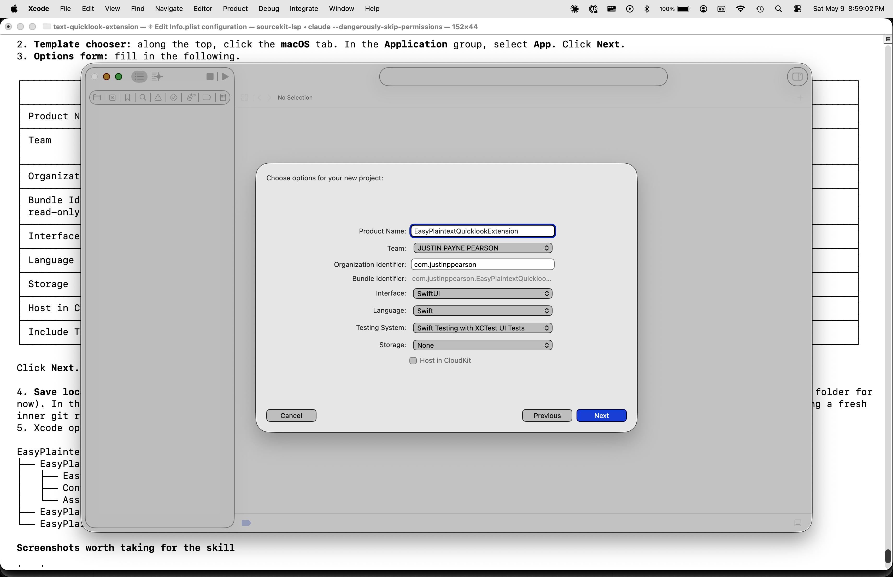

4. **Save location**: any directory will do; you'll move the resulting folder into the repo at the end. **Uncheck** "Create Git repository on my Mac" (the repo's existing `.git/` will be reused).
5. Xcode opens the project. The navigator should show the host app folder, plus test folders that we'll remove in phase 4.5.

   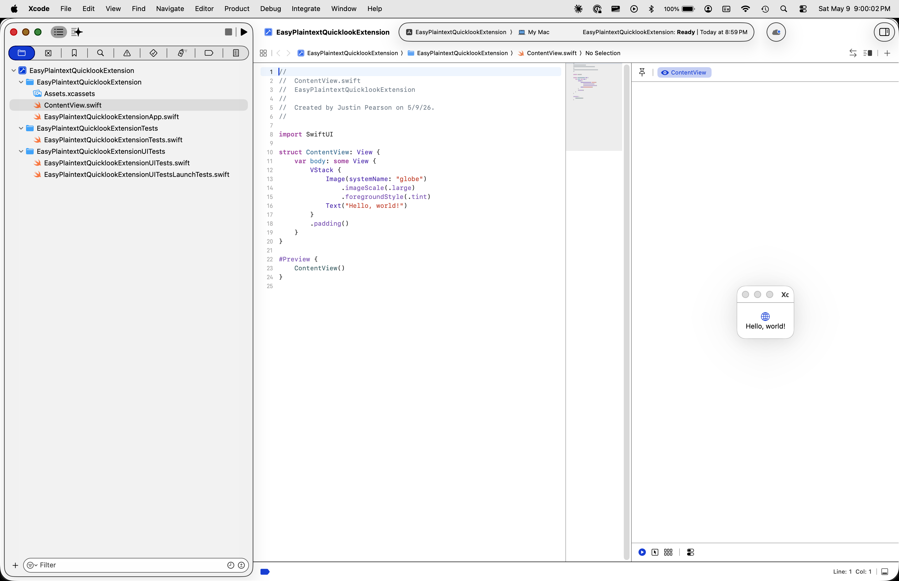

Wait for confirmation that phase 1 is done.

## Phase 2 — Add the Quick Look Preview Extension target (manual, in Xcode)

Tell the user:

1. With the project open, click the project root in the navigator. Select **File → New → Target…** (⌃⌘N), or click the **+** at the bottom of the TARGETS list in the project editor.
2. **Template chooser**: macOS tab → **Application Extension** group → **Quick Look Preview Extension**. (Typing "quick" in the filter narrows the list quickly.) Click **Next**.

   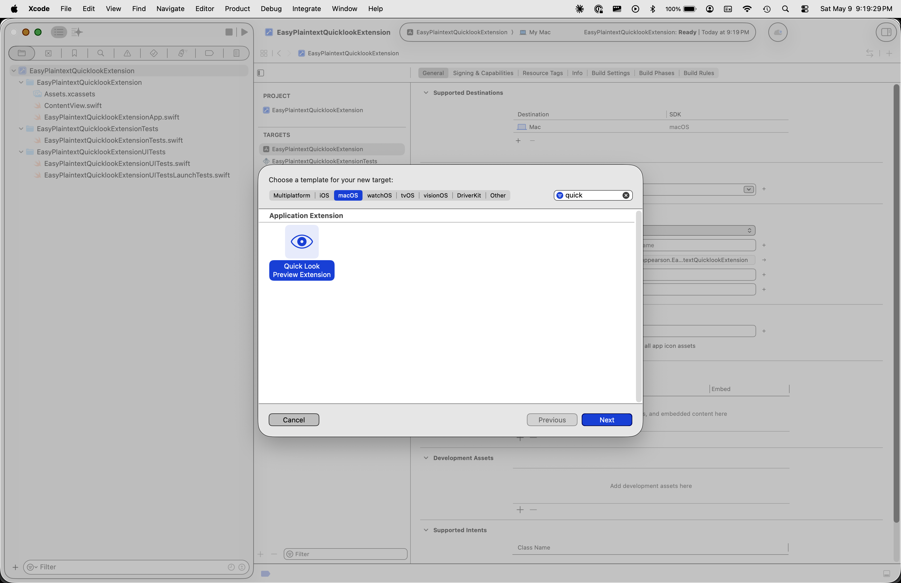

3. **Options form**: Product Name = `$EXT`, Team = same as host app, Embed in Application = `$PROJECT` (this should auto-populate). Click **Finish**.

   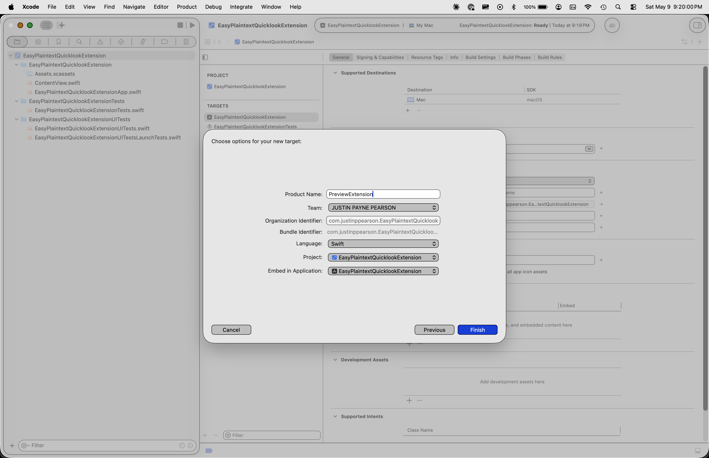

4. Xcode prompts to "Activate `$EXT` scheme?" — click **Don't Activate** (some Xcode versions show **Cancel**). The host app's scheme is the one we want active because building it builds and embeds the extension automatically.

   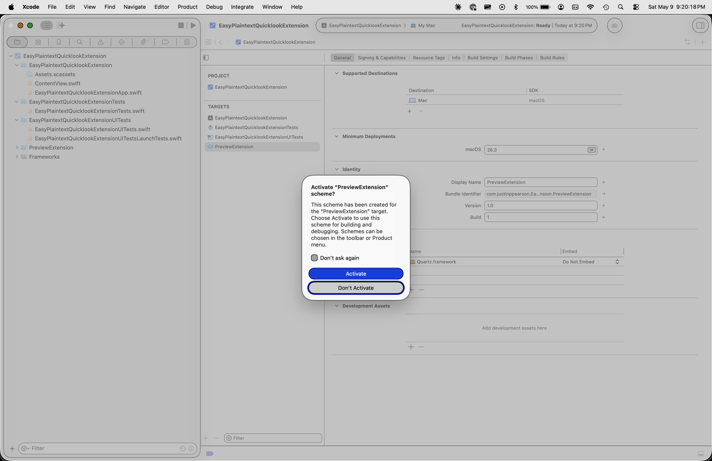

5. Confirm the project navigator now contains a new `$EXT/` folder with `Info.plist`, `PreviewProvider.swift`, `PreviewViewController.swift`, and `Base.lproj/PreviewViewController.xib`. Phase 4 will keep `PreviewProvider.swift` and delete the rest.

   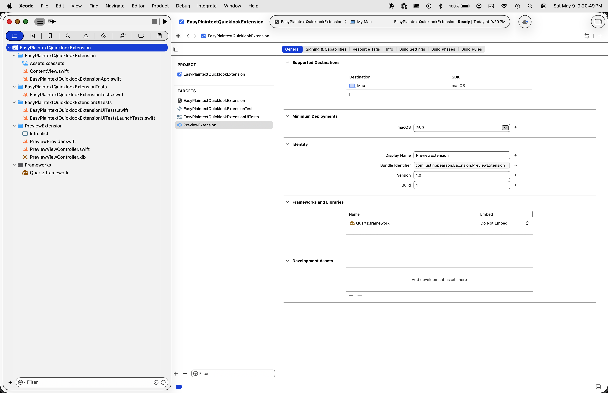

Wait for confirmation that phase 2 is done.

## Phase 3 — Edit the extension's Info.plist (automated)

The Xcode template generates `$EXT/Info.plist` with the view-based path as default. The `Info.plist` editor in Xcode shows three keys inside `NSExtensionAttributes` (with `QLIsDataBasedPreview = NO` and `QLSupportedContentTypes` empty) and `NSExtensionPrincipalClass` pointing at the view-based class:

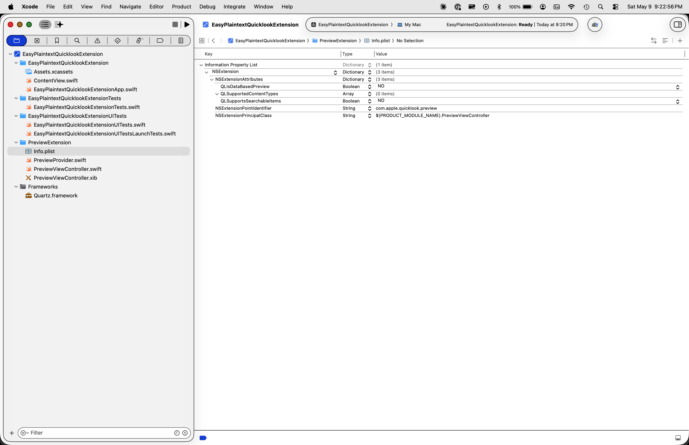

We swap it to the data-based path and declare the supported UTIs. Edit the file at `<xcode-project-dir>/$EXT/Info.plist`. Three coordinated changes inside the `NSExtension` dictionary:

1. Set `QLIsDataBasedPreview` from `<false/>` to `<true/>`.
2. Set `NSExtensionPrincipalClass` from `$(PRODUCT_MODULE_NAME).PreviewViewController` to `$(PRODUCT_MODULE_NAME).PreviewProvider`.
3. Replace the empty `<array/>` after the `QLSupportedContentTypes` key with:
   ```xml
   <array>
       <string>public.yaml</string>
       <string>public.toml</string>
   </array>
   ```

Use the `Edit` tool on the source `Info.plist`. After saving, tell the user that if Xcode has the file open with stale contents, they should choose "Use Version on Disk" / "Revert" when Xcode prompts about the file conflict. The final state should look like this (also showing the post-phase-4 navigator with the view-based scaffolding already gone):

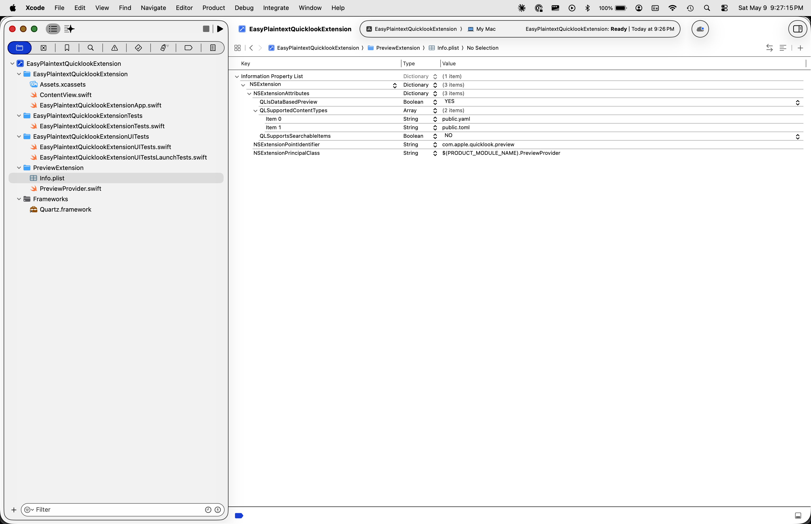

## Phase 4 — Replace PreviewProvider.swift and delete view-based scaffolding (automated)

Overwrite `<xcode-project-dir>/$EXT/PreviewProvider.swift` with the following. This is the entire functional implementation.

```swift
import Cocoa
import Quartz

class PreviewProvider: QLPreviewProvider, QLPreviewingController {
    func providePreview(for request: QLFilePreviewRequest) async throws -> QLPreviewReply {
        let fileURL = request.fileURL
        let reply = QLPreviewReply(dataOfContentType: .plainText,
                                   contentSize: CGSize(width: 800, height: 800)) { replyToUpdate in
            replyToUpdate.stringEncoding = .utf8
            return try Data(contentsOf: fileURL)
        }
        return reply
    }
}
```

Then delete the unused view-based scaffolding files (Xcode 16's synchronized folders pick up the deletions automatically; no pbxproj edits needed):

```sh
rm <xcode-project-dir>/$EXT/PreviewViewController.swift
rm <xcode-project-dir>/$EXT/Base.lproj/PreviewViewController.xib
rmdir <xcode-project-dir>/$EXT/Base.lproj 2>/dev/null || true
```

## Phase 4.5 — Remove test targets (only if you forgot to uncheck "Include Tests" in phase 1)

Skip this phase if phase 1's options form had **Include Tests** unchecked. If tests were included, the test targets are dead weight for this project (an extension whose entire logic is two lines doesn't earn unit tests), and removing them keeps the project file cleaner.

Tell the user the following Xcode UI steps (this can't be safely automated from outside Xcode because the test targets are scattered across many sections of `project.pbxproj`):

1. Click the project root in the navigator. In the **TARGETS** list, select the test target (e.g. `${PROJECT}Tests`).
2. Press **Delete** or right-click → **Delete**. Confirm in the dialog.
3. The target row disappears, but the source folder is still in the project navigator. Right-click the folder there and choose **Delete → Move to Trash**.
4. Repeat steps 1–3 for the UI test target.
5. **Product → Scheme → Manage Schemes…**. If test schemes still appear, select each and click **−** to remove.

   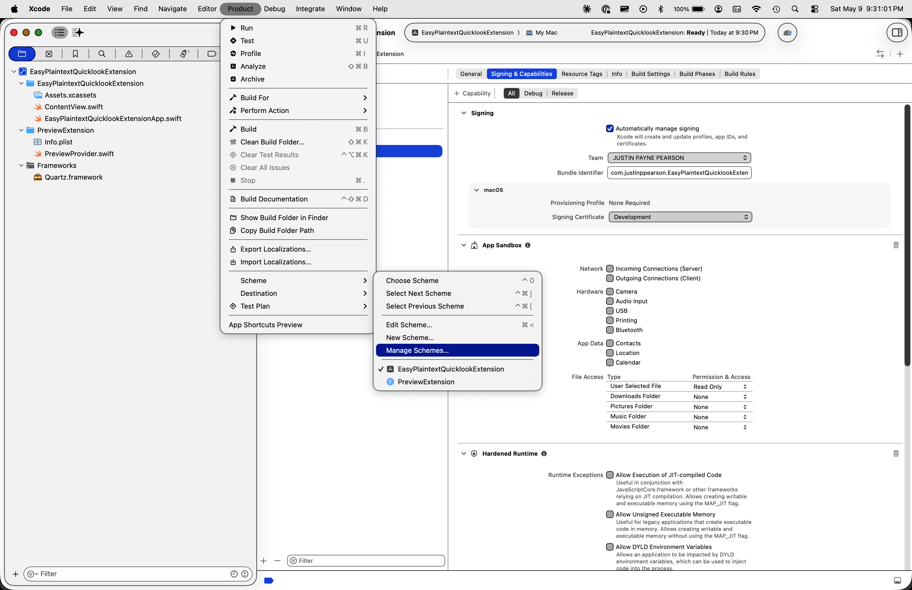

   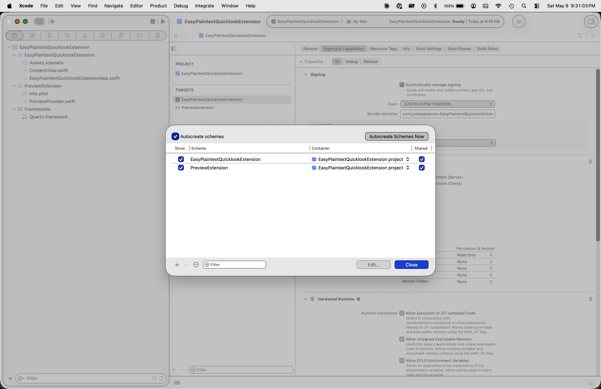

After this phase, the TARGETS list should contain only `$PROJECT` and `$EXT`.

## Phase 5 — Verify signing (automated)

The user should already have set their team in phase 1's options form, so this phase is a verification pass. The host app's **Signing & Capabilities** tab in Xcode should look roughly like this — automatically managed signing, a Team selected, Bundle Identifier populated, App Sandbox with User Selected File: Read Only, and Hardened Runtime enabled:

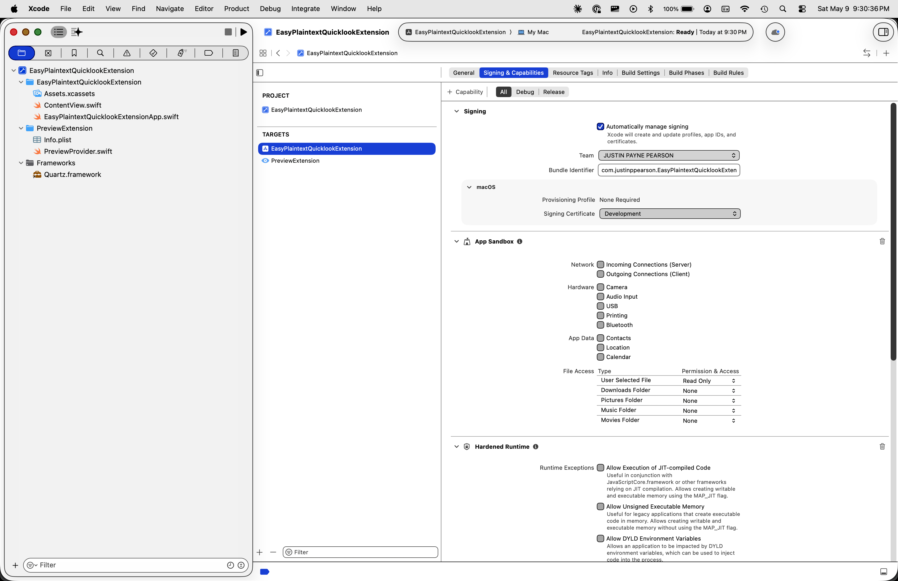

The extension target's tab should look similar, with the same Team and the same capability set:

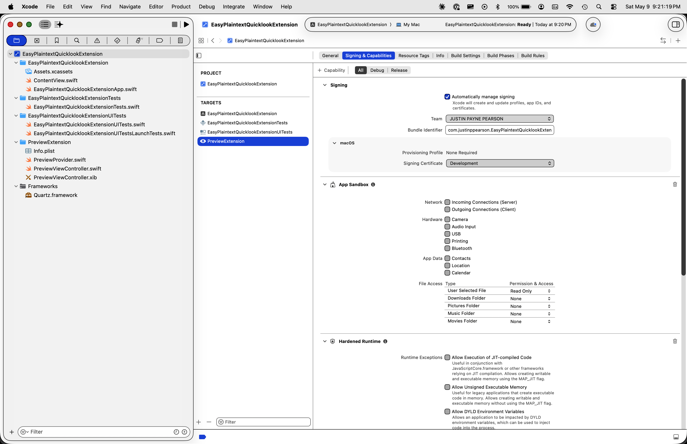

For each target, dump the signing-relevant build settings:

```sh
for T in $PROJECT $EXT; do
  echo "--- $T ---"
  xcodebuild -showBuildSettings -project <xcode-project-dir>/$PROJECT.xcodeproj \
    -target "$T" -configuration Debug 2>/dev/null \
    | grep -E '^\s*(DEVELOPMENT_TEAM|PRODUCT_BUNDLE_IDENTIFIER|CODE_SIGN_STYLE|CODE_SIGN_IDENTITY|ENABLE_APP_SANDBOX|ENABLE_HARDENED_RUNTIME|ENABLE_USER_SELECTED_FILES) ='
done
```

Verify both targets have:

- `DEVELOPMENT_TEAM` = a real team ID (10 alphanumerics), and the **same** team for both targets
- `CODE_SIGN_STYLE` = Automatic
- `ENABLE_APP_SANDBOX` = YES
- `ENABLE_HARDENED_RUNTIME` = YES
- `ENABLE_USER_SELECTED_FILES` = readonly (extension target only — confirm this one specifically)

If anything is wrong, tell the user to fix it in Xcode's Signing & Capabilities tab before we build.

## Phase 6 — Build (automated)

```sh
xcodebuild -project <xcode-project-dir>/$PROJECT.xcodeproj \
           -scheme $PROJECT -configuration Debug build 2>&1 | tail -3
```

Confirm `** BUILD SUCCEEDED **`.

## Phase 7 — Install and register (automated)

```sh
SRC=$(xcodebuild -showBuildSettings -project <xcode-project-dir>/$PROJECT.xcodeproj \
       -scheme $PROJECT -configuration Debug 2>/dev/null \
       | awk -F' = ' '/BUILT_PRODUCTS_DIR =/ {print $2}')/$PROJECT.app
DEST=/Applications/$PROJECT.app
[ -e "$DEST" ] && rm -rf "$DEST"
cp -R "$SRC" "$DEST"
open "$DEST"
sleep 2
killall QuickLookUIService 2>&1 || true
pluginkit -m -i $ORG.$PROJECT.$EXT
```

The final `pluginkit` call should show a leading `+`. If it doesn't, run `pluginkit -e use -i $ORG.$PROJECT.$EXT` and `killall QuickLookUIService` again.

## Phase 8 — Verify (manual, by user)

> In Finder, navigate to `examples/` (in the repo) and spacebar `yamllint.yml`. The file's text contents should appear. Spacebar `sample.toml` to confirm TOML works too.

## Phase 9 — Move into repo (optional, if user wants to commit the rebuilt project)

If the user created the project in a temporary directory and wants to replace the bundled `.xcodeproj` with their freshly-built one:

```sh
# Close Xcode first.
mv <xcode-project-dir>/$PROJECT.xcodeproj /path/to/repo/
mv <xcode-project-dir>/$PROJECT          /path/to/repo/
mv <xcode-project-dir>/$EXT              /path/to/repo/
```

Then verify the build still works from the repo location and commit.
