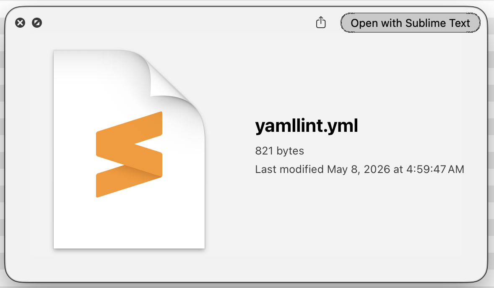
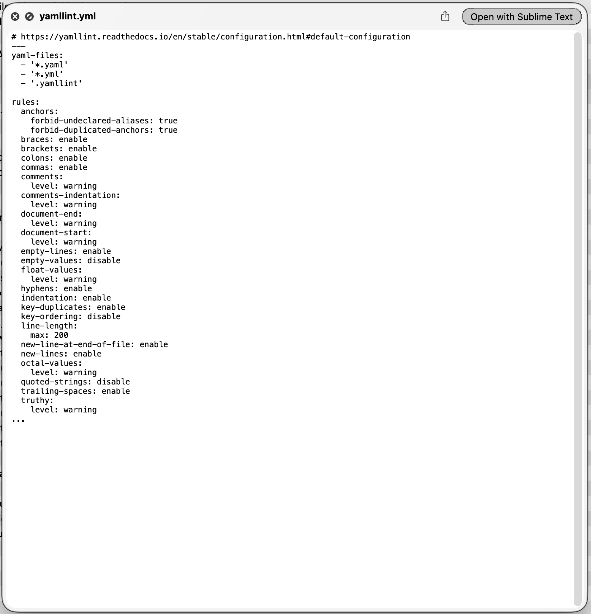
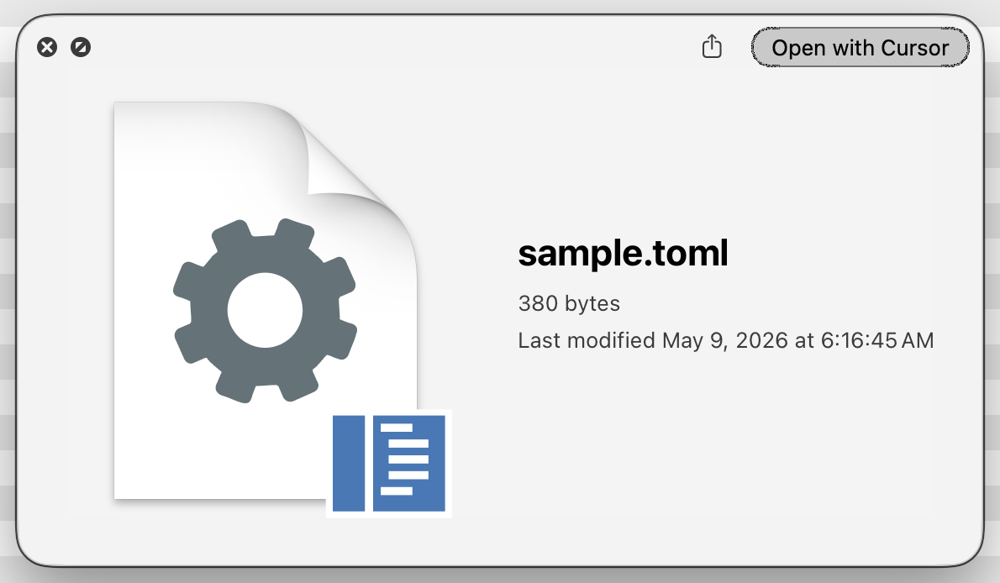
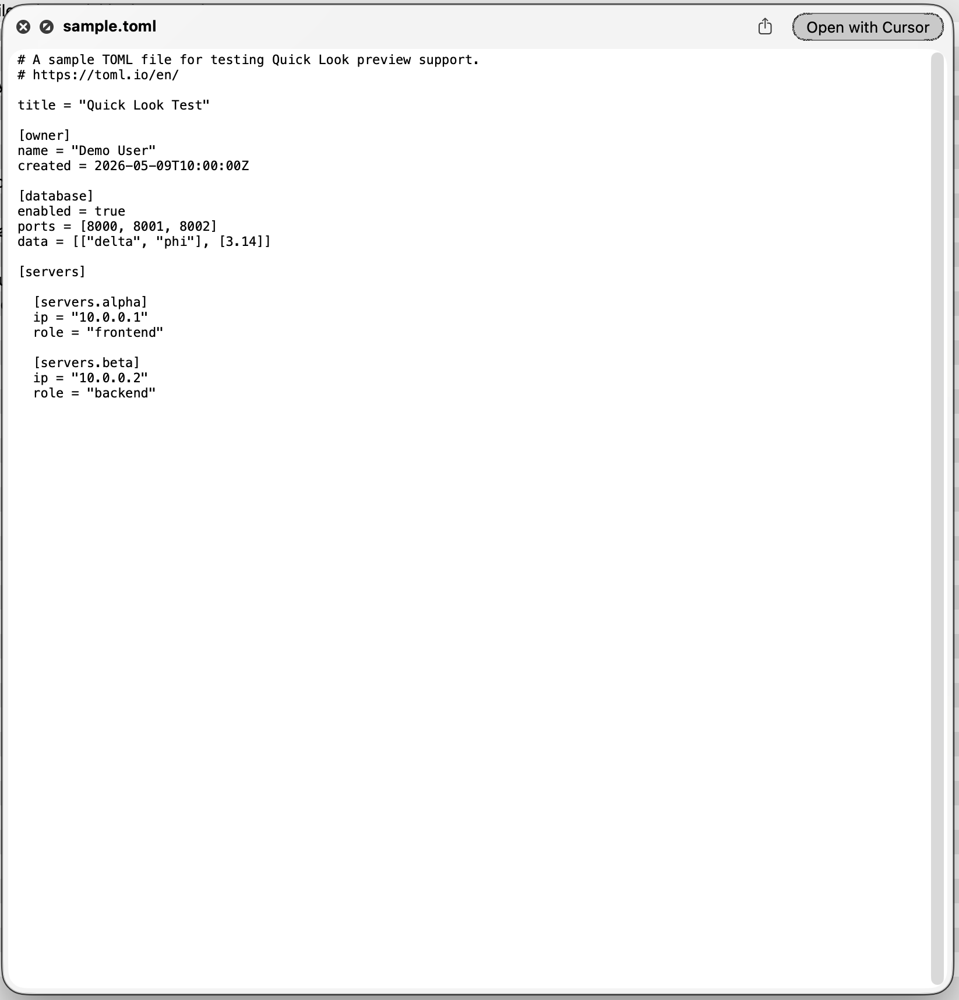
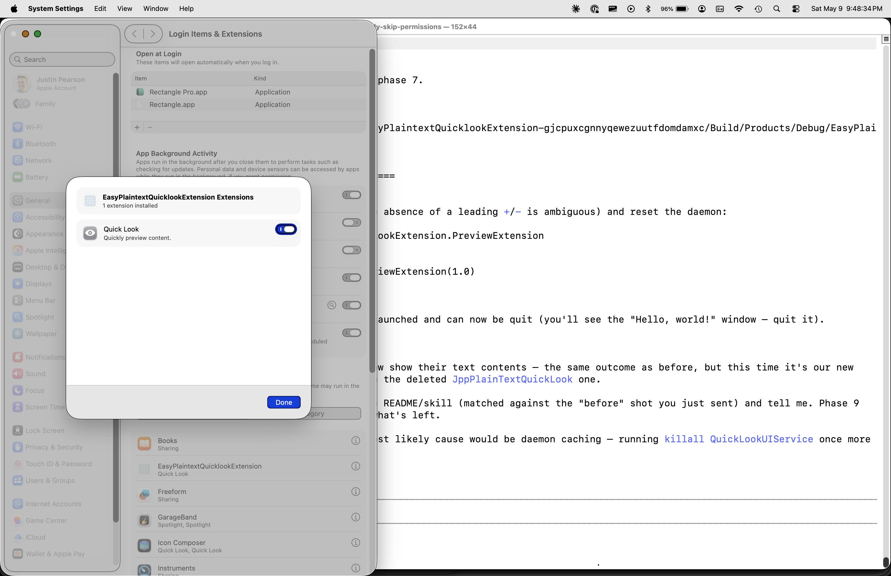

# easy-plaintext-quicklook-extension

A small macOS Quick Look Preview Extension that fills in Finder-spacebar text previews for `.yaml`, `.yml`, `.toml`, and any other plain-text-based file extension you'd like to add. Targets macOS Tahoe (26.x) and later.

| | Before | After |
|---|---|---|
| `.yaml` |  |  |
| `.toml` |  |  |

## Why this exists

By default, macOS does not preview YAML or TOML files in Finder. Pressing spacebar on a `.yaml` or `.toml` file shows a generic-document icon instead of the file's text contents.

When `quicklookd` (the system service that drives Quick Look) is asked to preview a file, it walks the file's UTI conformance tree leaf-first and picks the first installed provider that claims any UTI in that tree. For a `.yaml` file the tree is roughly `public.yaml → public.text → public.data → public.item`. Apple's built-in providers — the legacy `/System/Library/QuickLook/Text.qlgenerator` and the modern `QLPreviewGenerationExtension.appex` shipped with QuickLookUI — both claim `public.plain-text` along with a handful of specific subtypes (`public.json`, `public.xml`, `public.rtf`, etc.) but **not** `public.text`. And `public.yaml` is declared by macOS as conforming to `public.text` directly, not via `public.plain-text`, so the tree walk from `public.yaml` never reaches a UTI that any installed provider claims. The result is the generic-document icon. The same logic explains TOML and several other plain-text formats Apple knows about as a UTI but does not preview.

This extension fills the gap. It claims `public.yaml` and `public.toml` directly (and any other UTIs you add), reads the file's bytes, and hands them back to macOS labelled as `UTType.plainText`, which the system's plain-text renderer handles. The result is identical to how `.json` and `.xml` already preview — same font, same window chrome, same scroll behaviour — because the same underlying renderer is doing the work once we route the file to it. There is no syntax highlighting, no third-party library, no auto-update mechanism, and roughly ten lines of Swift in a sandboxed Quick Look Preview Extension target.

For a deeper architectural walk-through of how Quick Look resolves previews — including the diagnostic procedure for any "why doesn't this file preview?" situation, not just YAML and TOML — see [`docs/quicklook-investigation.md`](docs/quicklook-investigation.md).

## Installation

### With Claude Code (recommended)

```sh
git clone https://github.com/justinpearson/easy-plaintext-quicklook-extension.git
cd easy-plaintext-quicklook-extension
claude
```

Then, inside Claude Code, run one of:

- **`/install`** — builds the bundled Xcode project, signs with your Apple Developer team, copies the resulting `.app` into `/Applications/`, and registers the extension with macOS. Three to five minutes end to end.
- **`/clean-install`** — walks you through creating a fresh Xcode project from scratch in Xcode's UI, then automates the rest. Use this if `/install` fails for any reason — most commonly Apple-side issues like cert mismatches or Xcode version drift that prevent the bundled `.xcodeproj` from building cleanly.

After install, spacebar a file in `examples/` to verify.

### Manual (no Claude Code)

If you'd rather run the steps yourself:

1. Open `EasyPlaintextQuicklookExtension.xcodeproj` in Xcode.
2. Set the signing team for both targets (`EasyPlaintextQuicklookExtension` and `PreviewExtension`) to your Apple Developer team — see [Building from a fork](#building-from-a-fork) below.
3. **Product → Build** (or `xcodebuild -project EasyPlaintextQuicklookExtension.xcodeproj -scheme EasyPlaintextQuicklookExtension -configuration Debug build` from the terminal).
4. Locate the built `.app`: **Product → Show Build Folder in Finder**, then `Products/Debug/EasyPlaintextQuicklookExtension.app`.
5. Drag the `.app` into `/Applications/`.
6. Double-click it once. A "Hello, world!" window may appear; close it. The single launch is what causes macOS to discover and register the embedded Quick Look extension.
7. From the terminal: `killall QuickLookUIService`. This drops the running daemon's cached plugin list so it picks up the new extension.
8. Test: spacebar `examples/yamllint.yml` in Finder.

## Verifying the extension is enabled

To see the user-facing on/off toggle: **System Settings → General → Login Items & Extensions**. Scroll the right-hand pane to the section listing apps that provide extensions, click the **(i)** info button next to **EasyPlaintextQuicklookExtension**, and the popover shows **Quick Look** with an enable toggle. This is the GUI equivalent of `pluginkit -e use/ignore -i <bundle-id>`.



The terminal equivalent for confirming registration:

```sh
pluginkit -m -i com.justinppearson.EasyPlaintextQuicklookExtension.PreviewExtension
```

A leading `+` in the output means enabled; `-` means disabled.

## Adding new plain-text file types

Three diagnostic checks followed by a one- or two-line `Info.plist` edit, then rebuild and reinstall. With Claude Code, run **`/add-new-file-extension <path/to/sample.ext>`** and it does all of this automatically. The manual procedure:

**Diagnose first.** Confirm there is a problem to solve: select a file of the new format in Finder and press spacebar. If a text preview already appears, macOS handles that format natively and no work is needed. If the generic-document icon appears, continue.

**Find the UTI macOS assigns.** Run:

```sh
mdls -name kMDItemContentType -name kMDItemContentTypeTree path/to/file.ext
```

The first value names the UTI; the second names its conformance chain. Two outcomes matter. A recognizable UTI string like `public.toml`, `public.python-script`, or `net.daringfireball.markdown` means macOS already has a built-in declaration for the format. A UTI beginning with `dyn.` (for example `dyn.ah62d4rv4ge8023pftb2gn5xguq`) is a synthetic placeholder and means macOS does not know the format at all.

**Confirm `public.text` appears in the conformance chain.** This extension's implementation hands the file's bytes to macOS labeled as `UTType.plainText`, which only renders sensibly for formats that are actually text. For binary formats the bytes will display as garbage, and a different rendering strategy would be required.

**For a UTI macOS already knows,** add it as a new `<string>` entry inside `QLSupportedContentTypes` in `PreviewExtension/Info.plist`. Rebuild the project, replace the `.app` in `/Applications/` with the new build, launch the host app once so macOS re-registers the extension, and run `killall QuickLookUIService`. Spacebar a fresh file of the new format to verify.

**For a UTI macOS does not know,** additionally declare a custom UTI in `PreviewExtension/Info.plist` under `UTExportedTypeDeclarations`. The custom UTI must conform to `public.plain-text` and must bind the file extension via `UTTypeTagSpecification`. List that custom UTI in `QLSupportedContentTypes` alongside any others. Build, reinstall, and reset the daemon as before.

## Uninstall

With Claude Code, run **`/uninstall`** for an automated cleanup. The manual procedure:

1. Quit any open Quick Look windows (press Esc).
2. *(Optional but tidy)* Force-drop the cached `pluginkit` registration so macOS forgets about the extension immediately rather than during its next periodic scan:

   ```sh
   pluginkit -r /Applications/EasyPlaintextQuicklookExtension.app/Contents/PlugIns/PreviewExtension.appex
   ```
3. Drag `/Applications/EasyPlaintextQuicklookExtension.app` to the Trash.
4. `killall QuickLookUIService`.
5. *(Optional)* Empty the Trash.

After uninstall, `.yaml` and `.toml` files revert to the generic-document icon in Finder.

## Architecture: the host app + extension model

The Xcode project has two targets:

- **`EasyPlaintextQuicklookExtension`** — the host app. A near-empty SwiftUI app that exists purely as a carrier for the extension. The "Hello, world!" window is the entire user-visible UI. It does nothing useful at runtime.
- **`PreviewExtension`** — the actual Quick Look code. Compiled to `PreviewExtension.appex` and embedded inside the host app at `Contents/PlugIns/PreviewExtension.appex`.

When you build, Xcode produces a single `.app` bundle that contains the `.appex` inside its `PlugIns` folder. When you launch the `.app` once after installation, macOS's `LaunchServices` scans the bundle, sees the embedded `.appex`, and registers it with `pluginkit` for the `com.apple.quicklook.preview` extension point. After that one-time registration, the host app's process is no longer needed — but **the `.app` bundle on disk is, because that's where the `.appex` code actually lives.**

When you press spacebar on a `.yaml` file, macOS does not launch the host app. It launches the `.appex` as a separate XPC helper process, sandboxed and managed by `pluginkit`. The host app's process is unrelated to that.

This is why the install steps say "drag to `/Applications/`" rather than "double-click to install." There is no install step in the iOS sense; LaunchServices treats the presence of the `.app` in an indexed location *as* the install. Deleting the `.app` deletes the `.appex` along with it and Quick Look previews stop working immediately.

The host app exists at all because Apple's extension model requires extensions to be embedded in a host application bundle. The host bundle is the unit of code-signing, notarization, installation, and Finder/Launchpad/Spotlight discovery. Standalone extensions don't exist as a deliverable in macOS. Some hosts are full apps with real UIs (Notes, Safari) where the extension is a side feature; for this project, the host genuinely does nothing useful and exists only as a carrier.

## Building from a fork

The bundled `project.pbxproj` has the original author's Apple Developer Team ID (`AMXKCKJQUB`) baked into the build settings. Apple stamps that ID into every signed binary the original author ships, treats it as public information, and exposes it via `codesign -dv` on any of those binaries — so it is not a secret. But a fork build under that ID will fail with a signing error because you are not a member of that team.

The fix is one-time and takes a few seconds:

1. Open the project in Xcode.
2. Click the project root in the navigator.
3. For each target (`EasyPlaintextQuicklookExtension` and `PreviewExtension`), open the **Signing & Capabilities** tab and change **Team** to your own Apple Developer team. Xcode rewrites `project.pbxproj` in place with your Team ID and the build will succeed.

A free Apple ID's Personal Team works for local installation, but its development certificates eventually expire (Apple does not publish a guaranteed lifetime, and revocation can happen silently). A paid Apple Developer Program membership avoids the expiration question. Either way, the fix above is the same.

## Project structure

```
.
├── EasyPlaintextQuicklookExtension.xcodeproj/   Xcode project file
├── EasyPlaintextQuicklookExtension/             host app sources (mostly empty)
│   ├── EasyPlaintextQuicklookExtensionApp.swift
│   ├── ContentView.swift
│   └── Assets.xcassets/
├── PreviewExtension/                            the extension itself
│   ├── PreviewProvider.swift                    ~10 lines of meaningful code
│   └── Info.plist                               where QLSupportedContentTypes lives
├── examples/                                    sample files for manual testing
├── images/                                      before/after screenshots used by this README
├── docs/                                        architectural deep-dive on macOS Quick Look
├── .claude/skills/                              install / clean-install / add-new-file-extension / uninstall
├── README.md                                    this file
├── LICENSE                                      MIT
└── .gitignore                                   excludes DerivedData, xcuserdata, .DS_Store
```

All actual functionality lives in `PreviewExtension/PreviewProvider.swift`, which is short enough to inline here:

```swift
class PreviewProvider: QLPreviewProvider, QLPreviewingController {
    func providePreview(for request: QLFilePreviewRequest) async throws -> QLPreviewReply {
        let fileURL = request.fileURL
        let reply = QLPreviewReply(dataOfContentType: .plainText,
                                   contentSize: CGSize(width: 800, height: 800)) { replyToUpdate in
            replyToUpdate.stringEncoding = .utf8
            return try Data(contentsOf: fileURL)
        }
        return reply
    }
}
```

## License

MIT — see [LICENSE](LICENSE).
